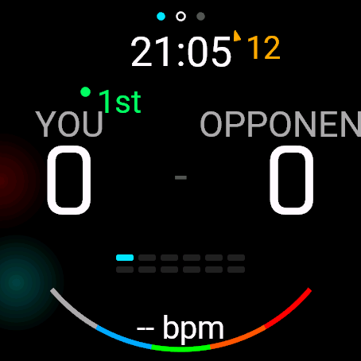
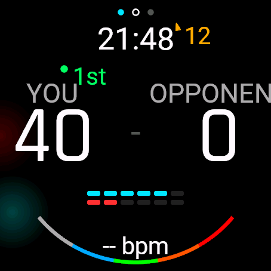
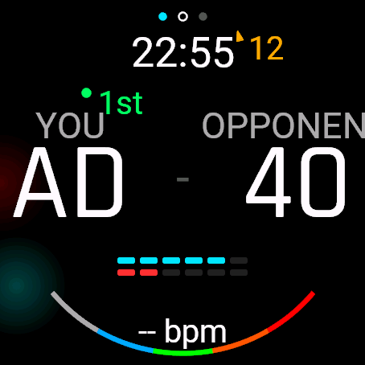
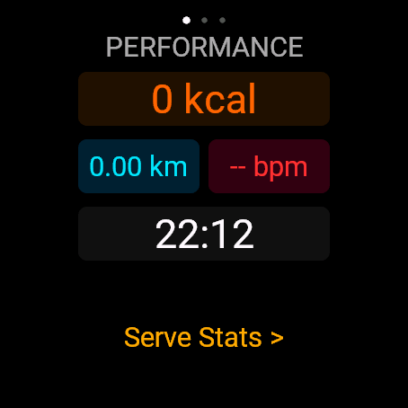
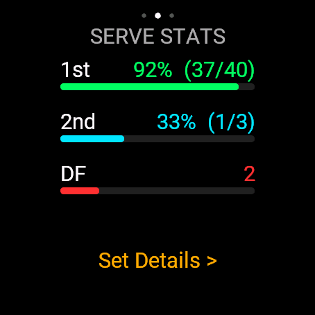
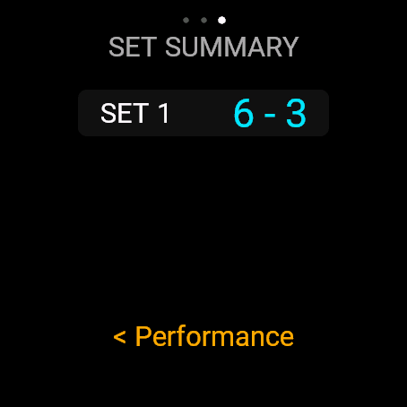

# 🎾 Garmin Tennis - Fenix 8 Score & Activity Tracker

[](https://developer.garmin.com/connect-iq/)
[](https://developer.garmin.com/connect-iq/monkey-c/)
[](https://www.garmin.com/)

A modern, high-performance Tennis score tracker and activity recorder application built specifically for the **Garmin fēnix® 8** smartwatch (47mm & 51mm AMOLED / Solar) using the Connect IQ SDK.

---

## 📸 App Screenshots & User Interface

### 🎾 Main Menu & In-Match Scoreboard
| Main Menu | Scoreboard Display | Server Selection |
| :---: | :---: | :---: |
|  |  |  |

### 📊 In-Match Analytics & Performance
| Performance Metrics | Serve Statistics | Set Summary |
| :---: | :---: | :---: |
|  |  |  |

---

## ✨ Features

- **🎾 Real-time Tennis Score & Serve Tracking:**
  - Standard point scoring (0, 15, 30, 40, Game, Deuce, Advantage).
  - Live 1st Serve, 2nd Serve & Double Fault (DF) tracking.
  - Configurable Sets (1 Set, Best of 3, Best of 5).
  - Game Modes: **Advantage** or **No-Ad (Deciding Point)**.
  - Tiebreak & Super Tiebreak logic built-in.
  - Full **Undo** functionality for accidental point inputs.

- **⏱️ Flexible Activity & Training / Warmup Mode:**
  - **Start Activity First:** Track your pre-match warmups, practice rallies, calories, heart rate, and distance before starting the match.
  - **Seamless Match Transition:** Easily launch tennis match scoring at any point via the menu without interrupting your ongoing activity recording.
  - **All-in-One Session Logging:** Warmup and match metrics are combined into a single, comprehensive Garmin Connect activity record.

- **📊 Comprehensive 3-Page Graphical Statistics:**
  - **Performance Card View:** Real-time Calorie burn (`kcal`), Elapsed Distance (`km`), Current Heart Rate (`bpm`), and Match Duration timer.
  - **Serve Analytics View:** Graphical progress bars for 1st Serve %, 2nd Serve %, and Double Fault (DF) counts.
  - **Set Summary View:** Historical set breakdown cards displaying completed set scores.

- **❤️ Garmin FIT Activity & Sensor Integration:**
  - Native Activity Recording (`ActivityRecording.SPORT_TENNIS`).
  - Saves tennis match statistics, total calories, distance, and heart rate zones directly to **Garmin Connect**.
  - Custom FIT Data Contributors for tennis-specific metrics.

- **🍃 Real-time Weather & Wind Gauge:**
  - Live wind bearing arrow indicator and wind speed reading via Garmin Weather API.

- **📱 Touch & Hardware Button Support:**
  - Fully optimized for physical buttons (UP, DOWN, SELECT, BACK) as well as swipe & tap gestures.

---

## 🎮 Controls Guide

| Button / Input | In-Match Action | Menu / Stats Action |
| :--- | :--- | :--- |
| **UP Button (Top Left)** | Score point for **OPPONENT** | Scroll Up / Previous Page |
| **DOWN Button (Bottom Left)** | Score point for **YOU** | Scroll Down / Next Page |
| **LIGHT / MENU Key (Middle Left)** | Register **Serve Fault / Miss** (1st ➔ 2nd ➔ Double Fault) | Toggle Backlight |
| **SELECT / START (Top Right)** | Open In-Match Menu / Pause | Select / Confirm |
| **BACK / LAP (Bottom Right)** | **Undo** Last Point | Return / Close |
| **Swipe Up / Down** | Switch Stats Pages | - |

---

## 📂 Project Structure

```
GarminTennis/
├── source/
│   ├── GarminTennisApp.mc          # Main App Entry Point
│   ├── GarminTennisView.mc         # Main Match Scoreboard & UI Renderer
│   ├── GarminTennisDelegate.mc     # In-Match Input & Gesture Controller
│   ├── MatchState.mc               # Core Tennis Logic & FIT Recording State
│   ├── StatsView.mc                # 3-Page Graphical Stats View & Progress Bars
│   ├── MainMenu.mc                 # Pre-Match Settings & Navigation Menu
│   ├── InMatchMenu.mc              # Pause, Resume & End Match Menu
│   └── SaveConfirmationView.mc     # End Match Confirmation & FIT Save Dialog
├── resources/
│   ├── drawables/
│   ├── strings/
│   └── bitmaps/
├── monkey.jungle                   # Build Jungle Configuration
└── manifest.xml                    # App Permissions & Targeted Devices
```

---

## 🚀 Building & Running

### Prerequisites
1. Download & install [VS Code](https://code.visualstudio.com/).
2. Install the **Garmin Connect IQ Extension**.
3. Download Connect IQ SDK 7.x / 9.x via SDK Manager.

### Build Commands
```bash
# Compile PRG executable for fēnix 8 47mm
monkeyc -o bin/GarminTennis.prg -f monkey.jungle -y /path/to/developer_key -d fenix847mm_sim -w

# Launch on Connect IQ Simulator
monkeydo bin/GarminTennis.prg fenix847mm_sim
```

---

## 📄 License
This project is open source and available under the [MIT License](LICENSE).
